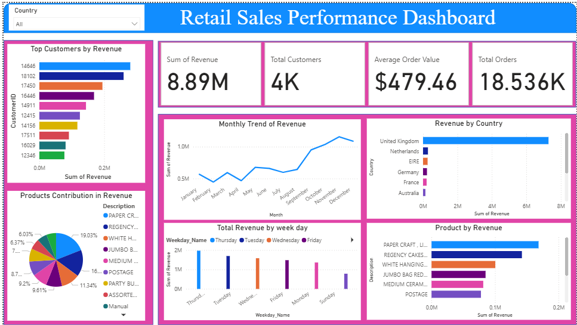

# Retail Sales Performance Analysis

## Project Overview

This project analyzes online retail transaction data to uncover insights about revenue trends, customer purchasing behavior, product performance, and geographic sales distribution.

Using **SQL for data analysis** and **Power BI for visualization**, the project transforms raw transactional data into actionable business insights that can support decision-making for marketing, sales strategy, and customer retention.

---

## Business Objectives

The goal of this analysis is to answer key business questions such as:

* How much revenue does the business generate and how many orders are processed?
* Which products generate the highest revenue?
* Who are the top spending customers?
* Which countries contribute the most to revenue?
* What are the monthly and weekly sales trends?
* Which products are frequently purchased together?
* Which customers may be at risk of churn?

---

## Dataset Overview

The dataset contains **international online retail transactions** with the following main fields:

| Column      | Description                         |
| ----------- | ----------------------------------- |
| InvoiceNo   | Unique order identifier             |
| Description | Product name                        |
| Quantity    | Number of items purchased           |
| InvoiceDate | Date of transaction                 |
| CustomerID  | Unique customer identifier          |
| Country     | Customer location                   |
| Revenue     | Calculated as Quantity × Unit Price |

Each row represents a transaction containing product, customer, and geographic information.

---

## Tools & Technologies Used

* **SQL (SQL Server)** – Data cleaning and analytical queries
* **Power BI** – Data visualization and dashboard creation
* **Python (Optional Analysis)** – Additional data processing
* **GitHub** – Project version control and portfolio presentation

---

## Key Business KPIs

| Metric              | Value   |
| ------------------- | ------- |
| Total Revenue       | $8.89M  |
| Total Orders        | 18,536  |
| Total Customers     | 4,339   |
| Average Order Value | $479.46 |

These KPIs indicate the business generates **high-value transactions from a moderate customer base**.

---

## Key Insights

### 1. Revenue Trends

Revenue shows a clear **seasonal pattern**, with strong growth between **September and November**, indicating increased demand during the holiday shopping period.

### 2. Geographic Sales Distribution

The **United Kingdom dominates revenue**, contributing the majority of sales and customers.

This suggests the business's **primary market is the UK**, while other countries represent growth opportunities.

### 3. Top Revenue-Generating Products

Top performing products include:

* PAPER CRAFT LITTLE BIRDIE
* REGENCY CAKESTAND 3 TIER
* WHITE HANGING HEART T-LIGHT HOLDER
* JUMBO BAG RED RETROSPOT

These products should be prioritized in inventory and marketing campaigns.

### 4. Customer Revenue Contribution

A small group of customers generates a **large share of total revenue**, identifying them as **VIP customers**.

Customer retention strategies such as loyalty programs or personalized promotions can help maintain these valuable relationships.

### 5. Weekly Sales Patterns

Orders peak toward the **end of the week**, especially **Thursday and Wednesday**, indicating that promotional campaigns during these days could increase sales further.

### 6. Product Bundling Opportunities

Several products are frequently purchased together, such as:

* Jumbo Bag Pink Polkadot + Jumbo Bag Red Retrospot
* Regency Teacup Collections
* T-Light Holder combinations

These patterns suggest opportunities for **product bundling and cross-selling strategies**.

### 7. Customer Churn Risk

Some customers have not made purchases for long periods, indicating potential **customer churn risk**.

Businesses can re-engage these customers through:

* Targeted email campaigns
* Discount offers
* Personalized marketing

---

## Power BI Dashboard

The Power BI dashboard provides an interactive view of the analysis, including:

* Revenue KPIs
* Monthly revenue trends
* Revenue by country
* Top customers by revenue
* Product performance
* Weekly sales patterns
* Product contribution distribution

This dashboard allows business users to quickly explore and understand sales performance.

---

## Project Structure

```
Retail-Sales-Performance-Analysis
│
├── SQL Queries
│   └── retail_analysis_queries.sql
│
├── Dashboard
│   └── Retail_Sales_Dashboard.pbix
│
├── Report
│   └── Retail_Sales_Performance_Analysis.pdf
│
└── README.md
```

---

## Business Recommendations

1. Focus marketing efforts on **top-performing products**.
2. Implement **product bundling strategies** to increase average order value.
3. Develop **loyalty programs for high-value customers**.
4. Re-engage inactive customers with targeted campaigns.
5. Expand marketing efforts in **non-UK markets** to diversify revenue sources.

---

## Conclusion

This project demonstrates how **data analysis and visualization can transform raw retail transaction data into actionable business insights**.

By analyzing customer behavior, product performance, and sales trends, businesses can make informed decisions that improve revenue growth, customer retention, and operational strategy.

---

## Author

**Rahul Singh**

* LinkedIn: https://www.linkedin.com/in/rahul-kumar-singh-1796b5332/
